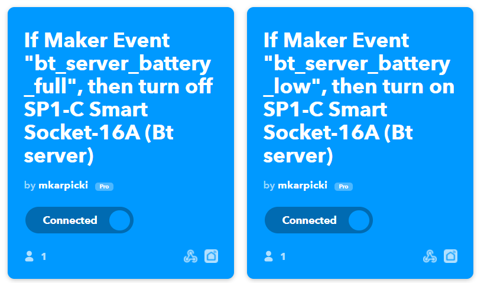

# Android Battery Level Reporter ( & Self Charging Control )

In this example I will build small solution for having Android device plugged in to Smart Plug and charged only when battery level wil go down.

Example itself does not have much value stand alone, but in combination with other projects (described in other article) may work well.

## Assumptions 
* device is connected to Smart Plug,
* when device's battery goes down to x%, it should turn on Smart Plug to be charged,
* when device's battery goes up yo y%, it should turn off Smart Plug and use battery

## Software and components

For purpose of this project I used Smart Plug from Gosund ([can be found on Amazon for example](https://www.amazon.de/dp/B085ZMF31V/ref=sr_1_3_sspa?__mk_pl_PL=%C3%85M%C3%85%C5%BD%C3%95%C3%91&dchild=1&keywords=gosund+smart+plug&qid=1620582611&sr=8-3-spons&psc=1&spLa=ZW5jcnlwdGVkUXVhbGlmaWVyPUEySEFWWUQ4VkhNMlFGJmVuY3J5cHRlZElkPUEwNTM4MDg3MVBKWkVJNVJYSFRVQyZlbmNyeXB0ZWRBZElkPUEwMTQ0NjY1MzdLRTJXS0FUQzUzNSZ3aWRnZXROYW1lPXNwX2F0ZiZhY3Rpb249Y2xpY2tSZWRpcmVjdCZkb05vdExvZ0NsaWNrPXRydWU=)). Reason I decided to use this one, was possibility to controll it via [ifttt.com](https://ifttt.com).

* Smart Plug
* [Smart Life](https://play.google.com/store/apps/details?id=com.tuya.smartlife&hl=en&gl=US) app from Google Play
* [IFTTT](https://ifttt.com) account
* (optional) [ThingSpeak](https://thingspeak.com) or [AWS](https://aws.amazon.com/) account
* Android Device (I used old Nexus 4 with Android 5.1.1)
* Android application implemented as part of this project :)

## Step 1. Configure Smart Plug.

As a first step, you need to prepare Smart Plug. 

Install Smart Life application on Android device and register an account.

When account is verified (code sent via email) you can start adding device. Choose "Socket (WI-FI)" and follow instructions provided by application.

This is it. You should be able to turn on and off your Smart Plug using application.

## Step 2. Enable HTTP control using IFTTT.

In this step, you will connect Smart Life with IFTTT, thanks to that you will be able to controll your Smart Plug using REST API.

Register [IFTTT](https://ifttt.com) account. 

Now you will need to create two Applets.

I will describe two ways how you can use Applets for this excersize. First, which I consider a bit less elegant but available when having free account and second which is similar but available for Pro users.

In both cases, Applets will will be created using two Services:
- Webhook
- Smart Life

### Option 1

Create first Applet:

For "IF This" choose Service called Webhook.You will be asked for `event_name` for it, I called mine "bt_server_batter_low" (as you can guess I expect this Applet to react whe battery of device will be low).

For "Then" choose Service called "Smart Life" (when you will select it, you will be prompted to link your Smart Life account so IFTTT will have permission to call it). When connected, chose one of proposed actions "Turn On". Smart Life will show you list of yours connected devices to select (you should see your Plug connected in Step 1)

Repeat Applet creation but this time, when adding Webhook Service, specify `event_name` as "bt_server_battery_full" and, when adding Smart Life Service as "Then", choose action "Turn Off" (and select same Plug).

Now, when you open "My Applets", you should see something like this:



Ok, so how to call you Webhook? Go to "My Services" using user menu and open "Webhooks" to find "Settings"

> My Services > Webhooks > Settings

You should see URL:
> https://maker.ifttt.com/use/xxxxx (where xxxx is your Api Key)

You can copy this Api Key and using CURL, Postman or just browser call such an API:
> https://maker.ifttt.com/trigger/{event_name}/with/key/{api_key}

As `event_name` use previously created event names from Applets creation, you should see Plug turning on and off.

This is basically it so why do I consider this as a bit less elegant idea and will present other approach?

When creating two Applets with different event names, you will need to specify on your device when to call which event depending on % of battery level. For example when batterry will go down to 5%, fire event "bt_server_batter_low". In case you would want to change it in future to react on 10% - you would need to change code on Android device. 

### Option 2

This option relies on Filters, this functionality is available only if you have Pro IFTTT account.

Filter is a logic written in Javascript which can be added between "If" and "Then" Services.

When Applet will be executed, filter can check information delivered in payload to decide if to skip "Then" Service.

You still need to create two Applets, and similar as before both will be using: 
* Webhook as "If"
* Smart Life as "Then"

Difference is, that now both can react to same `event_name`, for example "bt_server_battery_percentage". Same as before, one Applet should execute action "Turn on" and other "Turn off" via Smart Life Service.

When both Applets are created, open first one and click "Settings", you will see "+" icon between Services where you can add a "Filter".

Write logic of Filter (this example is used as Filter which will prevent switching off Plug)

```javascript
var percentage = parseInt(MakerWebhooks.event.Value1);

if (isNaN(percentage)) {
  Smartlife.turnOff.skip();

} else if (percentage < 95) {
  Smartlife.turnOff.skip();
}
```

This way, you can create two Applets reacting to same `event_name` and turning on and off your Plug. In both cases you will add proper Filter in which you will set condition based on battery % to skip Action.

Of course, you will need to add payload to your event and send request using POST:

```curl
 curl -X POST -H "Content-Type: application/json" -d '{"value1": "97"}' https://maker.ifttt.com/trigger/bt_server_battery_percentage/with/key/{api-key}
 ```

 As mentioned before, I find it a bit more elegant. Android device does not need to "know" when to turn on or turn off self-charging but just sends battery level and I can control logic from cloud.

 ### Other options

 Of course there are other ways if you do not want to send two events from Android device but only send battery level via one event and have possibility of controlling on what % value to turn on or off charging from web.

 You could for example create Lambda function if you have AWS account and send event from device to it. There you can add logic to (depending on battery level sent in payload) decide which Applet to trigger (still have 2 Applets, like in described option 1)

 Another service, which can be used as middle layer could be [ThingSpeak](https://thingspeak.com). It allows to create Channels with own REST API and attach "React" to it. This way you could send battery level values to ThingSpeak via REST API (and vizualize them over time) and depending on "React" logic trigger proper IFTTT API (Applet).

 ## Step 3. Implement Android application.

 @todo. describe app & usage of ThingSpeak (as app has)